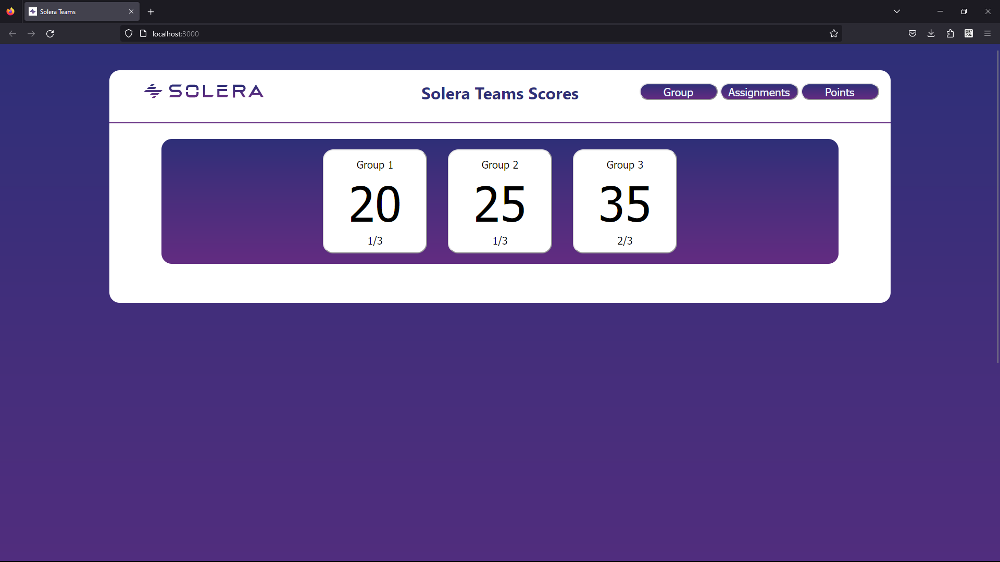
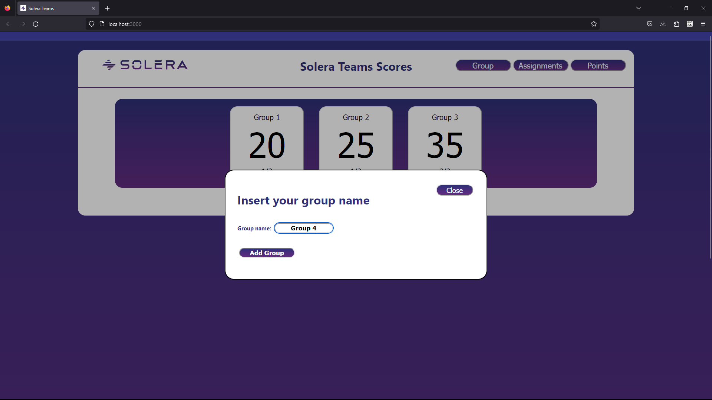
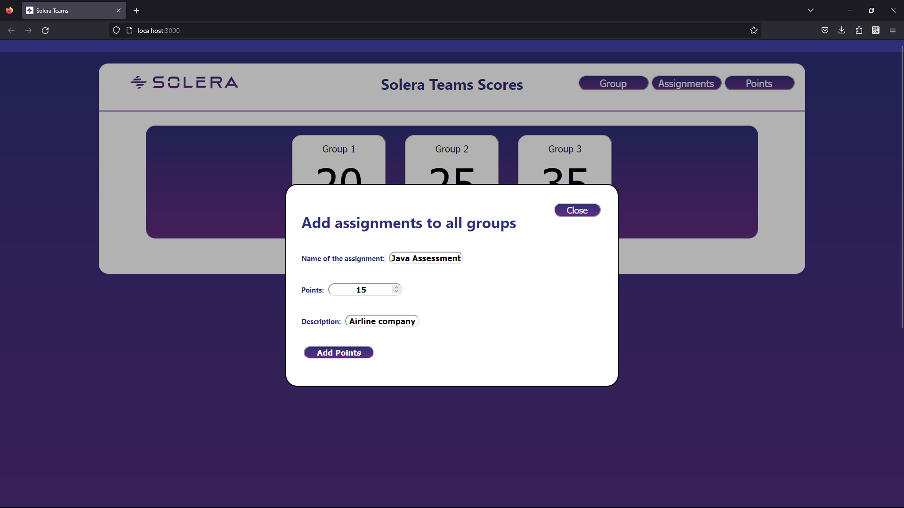
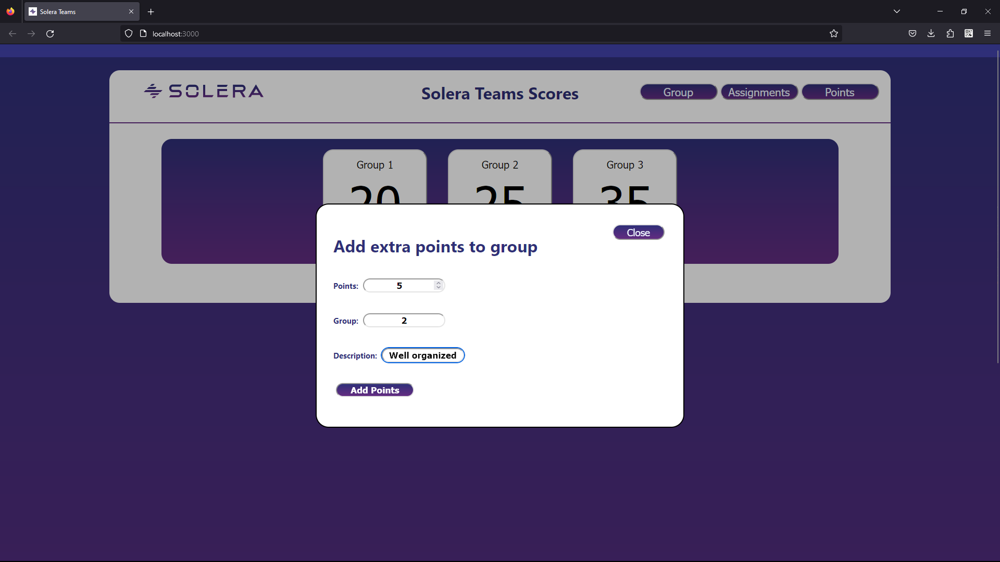
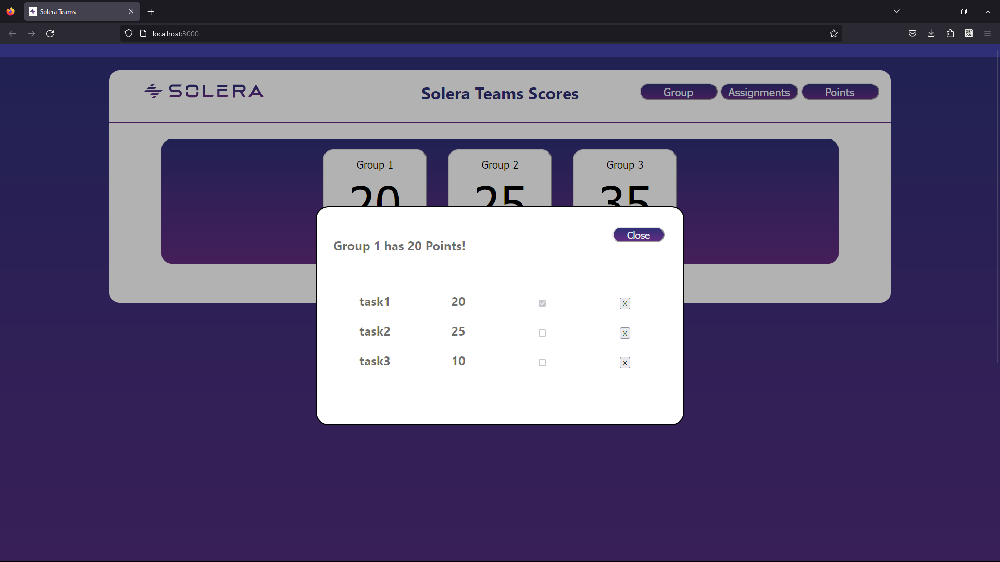

# Solera Bootcamp Project

## 1. Project Overview

The Solera Bootcamp Project was developed as a part of a bootcamp training program to simulate a real-world workflow environment. Developed within a tight timeframe of just 3 days, the primary objective of the project is to register and track points earned by different groups for completing tasks. This system allows for the creation of groups, tasks, and the ability to add or subtract points, providing a comprehensive view of each group's performance.

## 2. Technologies Used:

The frontend of the project was developed using React, a popular JavaScript library for building user interfaces. React's component-based architecture was leveraged to create reusable UI components, enhancing the efficiency and maintainability of the code.

## 3. Setup and Installation

### Frontend

To get the frontend up and running, follow these steps:

- **Prerequisites**: Ensure you have Node.js and npm (Node Package Manager) installed on your machine.
- **Clone the Repository**:

  ```bash
  git clone https://github.com/jndgoncalves/SoleraBootcampProjectFE.git
  ```

- **Navigate to the Project Directory**:

  ```bash
  cd SoleraBootcampProjectFE
  ```

- **Install Dependencies**:

  ```bash
  npm install
  ```

- **Start the Development Server**:

  ```bash
  npm start
  ```

The frontend application should now be running on [http://localhost:3000](http://localhost:3000).

### Backend

To see the full project in action, the backend server needs to be running. Here's a brief overview of how to set it up:

- **Prerequisites**: Ensure you have Java and Maven installed on your machine.
- **Clone the Backend Repository**:

  ```bash
  git clone https://github.com/AndreaC-94/SoleraBootcampProject.git
  ```

- **Navigate to the Backend Project Directory**:

  ```bash
  cd SoleraBootcampProject
  ```

- **Build and Run the Application using Maven**:

  ```bash
  mvn spring-boot:run
  ```

The backend server should now be running, and the frontend application can communicate with it to fetch and send data.

> **Note**: While the primary focus is on the frontend, having the backend running is essential for the full functionality of the project.

## 3. My Role

While the project was a collaborative effort, my primary responsibility revolved around handling the API calls, specifically fetching data from the backend. I ensured seamless communication between the frontend and backend, making certain that data was accurately retrieved and presented to the user.

### Team Members:

- **Front-End**:
  - [João Gonçalves](https://github.com/jndgoncalves)
  - [Nuno Taquelim](https://github.com/ntaquelim)
- **Back-End**:
  - [Andrea Colucci](https://github.com/AndreaC-94)
  - [Conor Fair](https://github.com/conorjfair)

## Screenshots

### Home Page



### New Group



### Add Assignments



### Extra Points



### Group Details


